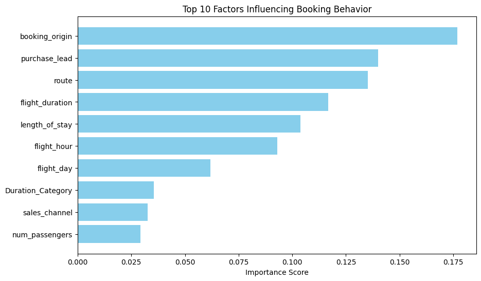

# ✈️ Airline Booking Prediction AI

## 📌 Project Overview
This project focuses on **predicting customer buying behavior** for an airline. By analyzing booking data, the model predicts whether a user will complete a booking (`0` = No, `1` = Yes). This solution helps airlines identify high-potential customers and optimize marketing strategies.

## 🛠️ Tech Stack
* **Language:** Python
* **Libraries:** Pandas, NumPy, Scikit-Learn, Matplotlib
* **Techniques:**
    * **SMOTE** (Synthetic Minority Over-sampling Technique) to handle imbalanced data.
    * **Random Forest Classifier** for robust predictions.
    * **Feature Importance Analysis** to identify key booking drivers.

## 📊 Workflow
1.  **Data Cleaning:** Handled missing values and mapped categorical variables (e.g., `flight_day`, `sales_channel`) to numerical formats.
2.  **Exploratory Analysis:** Visualized the distribution of booking channels (Internet vs. Mobile) and flight durations.
3.  **Model Training:**
    * Trained an initial Random Forest model (Accuracy: ~85%).
    * Applied **SMOTE** to balance the dataset (as actual bookings were a minority class).
    * Retrained to improve recall and precision for the positive class.
4.  **Insights:**
    * The **Route** and **Length of Stay** were identified as the most critical factors influencing a booking decision.
    * Booking origin and flight duration also played significant roles.

## 📈 Results
* **Model Accuracy:** ~85% on test data.
* **Key Insight:** Customers booking long-haul flights via specific routes showed a higher likelihood of completion.
* 

## 🚀 How to Run
1.  Clone the repository:
    ```bash
    git clone [https://github.com/YOUR-USERNAME/Airline-Booking-Prediction-AI.git](https://github.com/YOUR-USERNAME/Airline-Booking-Prediction-AI.git)
    ```
2.  Install dependencies:
    ```bash
    pip install pandas numpy scikit-learn matplotlib imbalanced-learn
    ```
3.  Run the notebook:
    ```bash
    jupyter notebook Booking_Model_Prediction.ipynb
    ```

---
Created by Anshuman Srivastava
